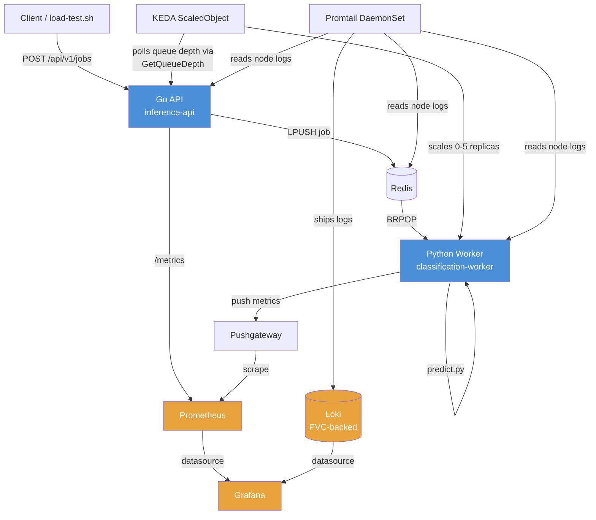

# Inference Orchestrator

A Kubernetes-native ML inference pipeline: a Go API queues jobs into Redis, a
Python worker processes them and writes results back, and the whole system is
observable (metrics + logs) and autoscales based on actual queue depth — not
just CPU/memory.

This is a learning project for ML infra fundamentals (Kubernetes, observability,
autoscaling), built incrementally and intended to migrate to a managed cloud
cluster (AKS/GKE) and later swap in Triton Inference Server.

> **Status:** Phase 1–2 (core pipeline + observability, including logs) complete.
> Currently building a second worker to prove multi-job-type orchestration.
> This README is updated as the project progresses — see `next_steps.md` for
> the detailed running log of what's done/next.

---

## Architecture (current state)



**Planned addition (next):** a second worker (`worker-2`) consuming its own
Redis queue key, with its own metrics and its own `ScaledObject`, so the API
routes jobs to different queues based on `type`.

---

## Components

| Component | Role |
|---|---|
| **Go API** (`inference-api`) | Accepts job submissions, pushes to Redis, exposes Prometheus metrics (`inference_jobs_submitted_total`, `inference_queue_depth`) |
| **Redis** | Job queue (`BRPOP`/`LPUSH`) |
| **Python Worker** (`classification-worker`) | Pulls jobs, runs inference via `predict.py`, pushes completion metrics to Pushgateway (no HTTP server, so push model instead of pull) |
| **Pushgateway** | Buffers worker metrics for Prometheus to scrape (workers are short-lived/scale-to-zero) |
| **Prometheus** | Scrapes API + Pushgateway |
| **Loki + Promtail** | Log aggregation — Promtail (DaemonSet) ships container logs to Loki (PVC-backed); queryable alongside metrics in Grafana |
| **Grafana** | Dashboards (submission/completion rates, latency percentiles) + Explore (ad-hoc Loki/Prometheus split-view queries) |
| **KEDA** | Scales `classification-worker` from 0→5 replicas based on live queue depth |

## Repo layout

```
k8s/
  api/            # Go API Deployment + Service
  redis/          # Redis Deployment + Service
  worker/         # Python classification worker Deployment + ScaledObject
  monitoring/
    loki/         # Loki Deployment, Service, PVC, ConfigMap
    promtail/     # Promtail DaemonSet, ConfigMap, RBAC (SA/ClusterRole/Binding)
    (prometheus, grafana, pushgateway manifests)
load-test.sh      # Fires valid + intentionally-invalid jobs at the API,
                  # for generating visible activity in Grafana
next_steps.md     # Running status log / roadmap
```

## Running locally (minikube)

```bash
minikube start
eval $(minikube docker-env)        # build images directly into minikube's daemon
kubectl apply -f k8s/redis/
kubectl apply -f k8s/api/
kubectl apply -f k8s/worker/
kubectl apply -f k8s/monitoring/
```

Get the API's externally-reachable URL:
```bash
minikube service inference-api-svc --url
```

Generate test traffic (valid + intentionally failing jobs, useful for seeing
queue-depth spikes and error logs together in Grafana):
```bash
export INFERENCE_API_URL="<url from above>"
./load-test.sh
```

View dashboards/logs:
```bash
kubectl port-forward svc/grafana-svc 3000:3000
```
Open `http://localhost:3000` → **Dashboards** for the pre-built inference
dashboard, or **Explore** for ad-hoc Loki/Prometheus queries.

## Notable design decisions / gotchas (worth remembering)

- **Push vs. pull metrics**: the worker has no HTTP server and can scale to
  zero, so it can't be scraped directly — it pushes to a Pushgateway instead,
  which Prometheus scrapes on a normal pull cycle.
- **KEDA over a plain HPA**: HPA can't scale below 1 replica; KEDA's
  `ScaledObject` can scale workers to true zero when the queue is empty,
  which matters for an inference workload that's idle most of the time.
- **Loki storage is a real PVC**, not `emptyDir` — logs survive pod restarts.
  Prometheus/Grafana are still ephemeral; revisit before/during cloud migration.
- **Promtail RBAC**: log shipping itself needs no special permissions (pure
  networking), but Promtail's Kubernetes service discovery (to attach
  pod/namespace/container labels) requires a ClusterRole granting
  `get/list/watch` on `pods` — pod-to-pod networking and Kubernetes-API access
  are governed by entirely separate mechanisms.

## Roadmap

See `next_steps.md` for the full, regularly-updated status log. Short version:

1. ~~Core pipeline (API → Redis → worker)~~ ✅
2. ~~Observability: Prometheus + Grafana~~ ✅
3. ~~Kubernetes migration + KEDA autoscaling~~ ✅
4. ~~Loki + Promtail log aggregation~~ ✅
5. **Second worker — multi-job-type orchestration** ← current
6. Cloud migration (AKS or GKE)
7. Triton Inference Server (replacing hand-rolled Python workers)
