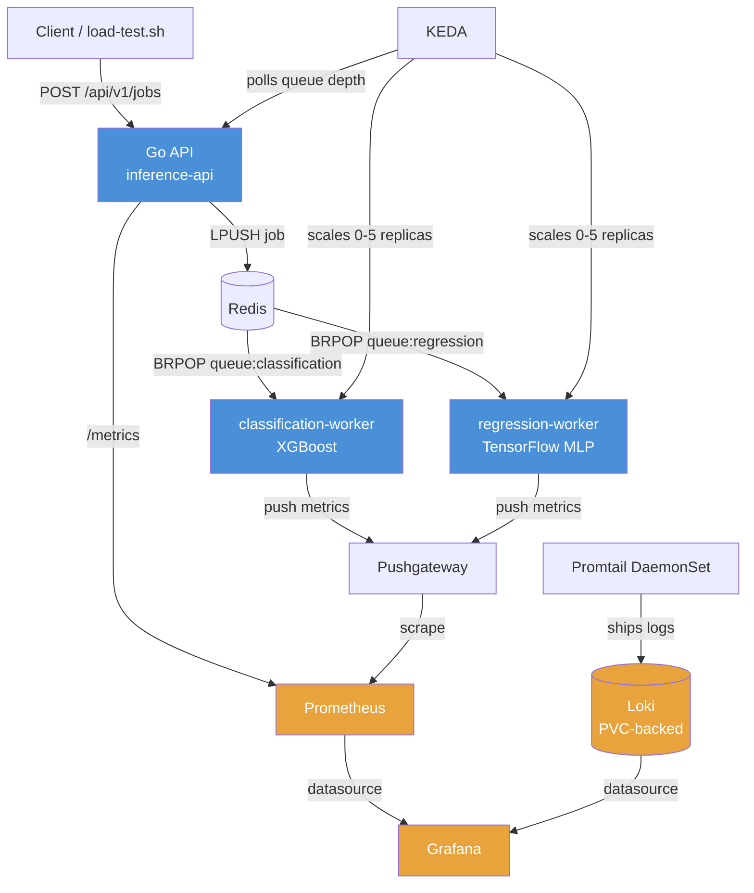

# Inference Orchestrator

A Kubernetes-native ML inference pipeline: a Go API queues jobs into Redis,
Python ML workers process them and write results back, and the whole system is
observable (metrics + logs) and autoscales based on actual queue depth — not
just CPU/memory.

This is a learning project for ML infra fundamentals (Kubernetes, observability,
autoscaling), built incrementally and deployed to a managed cloud cluster (EKS).

> **Status:** Complete — core pipeline, observability, Kubernetes migration,
> KEDA autoscaling, Loki/Promtail log aggregation, second worker
> (multi-job-type orchestration), Helm packaging, and EKS cloud migration all
> done. See `next_steps.md` for the full running log.

---

## Architecture


```mermaid
flowchart TB
    Client[Client / load-test.sh] -->|POST /api/v1/jobs| API[Go API<br/>inference-api]
    API -->|LPUSH job| Redis[(Redis)]
    API -->|/metrics| Prometheus[Prometheus]

    Redis -->|BRPOP queue:classification| CW[classification-worker<br/>XGBoost]
    Redis -->|BRPOP queue:regression| RW[regression-worker<br/>TensorFlow MLP]
    CW -->|push metrics| Pushgateway[Pushgateway]
    RW -->|push metrics| Pushgateway
    Pushgateway -->|scrape| Prometheus

    KEDA[KEDA] -->|polls queue depth| API
    KEDA -->|scales 0-5 replicas| CW
    KEDA -->|scales 0-5 replicas| RW

    Promtail[Promtail DaemonSet] -->|ships logs| Loki[(Loki<br/>PVC-backed)]

    Prometheus -->|datasource| Grafana[Grafana]
    Loki -->|datasource| Grafana

    style API fill:#4a90d9,color:#fff
    style CW fill:#4a90d9,color:#fff
    style RW fill:#4a90d9,color:#fff
    style Grafana fill:#e8a33d,color:#fff
    style Loki fill:#e8a33d,color:#fff
    style Prometheus fill:#e8a33d,color:#fff
```

---

## Components

| Component | Role |
|---|---|
| **Go API** (`inference-api`) | Accepts job submissions, routes to typed Redis queues (`queue:classification`, `queue:regression`), exposes Prometheus metrics and queue depth endpoint for KEDA |
| **Redis** | Job queue (`BRPOP`/`LPUSH`) — one queue key per job type |
| **classification-worker** | XGBoost model, pulls from `queue:classification`, pushes completion metrics to Pushgateway |
| **regression-worker** | TensorFlow MLP (Auto MPG, SavedModel format), pulls from `queue:regression`, pushes completion metrics to Pushgateway |
| **orchestrator-worker-base** | Shared pip package (installed via git URL) — owns the BRPOP loop, Redis status writes, Pushgateway push, and all error handling. Each worker only provides a `predict_fn` |
| **Pushgateway** | Buffers worker metrics for Prometheus (workers scale to zero, can't be scraped directly) |
| **Prometheus** | Scrapes API + Pushgateway |
| **Loki + Promtail** | Log aggregation — Promtail DaemonSet ships container logs from all pods to Loki (PVC-backed) |
| **Grafana** | Pre-built inference dashboard + Explore for ad-hoc Loki/Prometheus queries |
| **KEDA** | Scales each worker independently 0→5 replicas based on its own queue depth |

---

## Repo layout

```
helm/
  inference-orchestrator/
    Chart.yaml
    values.yaml           # minikube defaults
    values-cloud.yaml     # EKS overrides (image registry, pull policy, storage class)
    templates/
      api/
      redis/
      worker-classification/
      worker-regression/
      monitoring/         # prometheus, grafana, loki, promtail, pushgateway
load-test.sh              # fires valid + invalid jobs at both workers
next_steps.md             # running status log / roadmap
```

Worker repos (separate GitHub repos):
- `github.com/<you>/classification-worker`
- `github.com/<you>/mlp-regression-worker`
- `github.com/<you>/orchestrator-worker-base` — shared BRPOP loop

---

## Running locally (minikube)

### Prerequisites
- [minikube](https://minikube.sigs.k8s.io/)
- [kubectl](https://kubernetes.io/docs/tasks/tools/)
- [Helm v3](https://helm.sh/docs/intro/install/)
- [KEDA](https://keda.sh/docs/latest/deploy/) installed on the cluster

### 1. Start minikube

```bash
minikube start
```

### 2. Build images inside minikube's Docker daemon

```bash
eval $(minikube docker-env)

docker build -t inference-api:dev ./api
docker build -t classification-worker:dev /path/to/classification-worker
docker build -t mlp-regression-worker:dev /path/to/mlp-regression-worker
```

### 3. Deploy with Helm

```bash
helm install inference-orchestrator ./helm/inference-orchestrator \
  -f helm/inference-orchestrator/values.yaml
```

### 4. Verify

```bash
kubectl get pods -w      # worker pods start at 0 replicas -- that's expected
helm list
kubectl get svc
kubectl get scaledobject
```

### 5. Load test

```bash
export INFERENCE_API_URL=$(minikube service inference-svc --url)
chmod +x load-test.sh
./load-test.sh
```

The script fires valid jobs at both workers, bad-input jobs, an unknown job
type, an invalid Origin value (regression), and malformed JSON. Watch KEDA
scale the worker pods up during the run and back to zero after cooldown.

### 6. View dashboards

```bash
minikube service grafana-svc --url
```

- **Dashboards → Inference Orchestrator**: queue depth, completion rates,
  latency percentiles, split by `type` label
- **Explore → Loki**: filter `{app="classification-worker"}` or
  `{app="regression-worker"}` for per-worker logs
- **Explore → Prometheus**: `inference_jobs_completed_total{type="regression"}`,
  `inference_duration_seconds` etc.

### 7. Upgrade after changes

```bash
helm upgrade inference-orchestrator ./helm/inference-orchestrator \
  -f helm/inference-orchestrator/values.yaml
```

### 8. Tear down

```bash
helm uninstall inference-orchestrator
```

---

## Cloud deployment (EKS)

### Prerequisites
- AWS CLI v2 installed and configured (`aws configure`)
- `eksctl` installed
- Docker Hub account with images pushed

### 1. Push images to Docker Hub

```bash
docker build -t <dockerhub-username>/inference-api:v1.0.0 ./api
docker push <dockerhub-username>/inference-api:v1.0.0

docker build -t <dockerhub-username>/classification-worker:v1.0.0 .
docker push <dockerhub-username>/classification-worker:v1.0.0

docker build -t <dockerhub-username>/mlp-regression-worker:v1.0.0 .
docker push <dockerhub-username>/mlp-regression-worker:v1.0.0
```

### 2. Fill in values-cloud.yaml

```yaml
global:
  imagePullPolicy: Always

api:
  image:
    repository: <dockerhub-username>/inference-api
    tag: v1.0.0
  service:
    type: LoadBalancer

workers:
  classification:
    image:
      repository: <dockerhub-username>/classification-worker
      tag: v1.0.0
  regression:
    image:
      repository: <dockerhub-username>/mlp-regression-worker
      tag: v1.0.0

redis:
  storage:
    storageClassName: gp2

monitoring:
  grafana:
    service:
      type: LoadBalancer
  loki:
    storage:
      storageClassName: gp2
```

### 3. Provision the cluster

```bash
eksctl create cluster \
  --name inference-orchestrator \
  --region eu-west-2 \
  --nodegroup-name standard-workers \
  --node-type t3.medium \
  --nodes 2 \
  --nodes-min 2 \
  --nodes-max 3 \
  --managed
```

Takes 15-20 minutes. eksctl updates your kubeconfig automatically.

### 4. Install the EBS CSI driver (required for PVCs on EKS)

```bash
# Enable OIDC provider
eksctl utils associate-iam-oidc-provider \
  --cluster inference-orchestrator \
  --region eu-west-2 \
  --approve

# Create service account with EBS permissions
eksctl create iamserviceaccount \
  --name ebs-csi-controller-sa \
  --namespace kube-system \
  --cluster inference-orchestrator \
  --region eu-west-2 \
  --attach-policy-arn arn:aws:iam::aws:policy/service-role/AmazonEBSCSIDriverPolicy \
  --approve \
  --override-existing-serviceaccounts

# Install the addon
eksctl create addon \
  --name aws-ebs-csi-driver \
  --cluster inference-orchestrator \
  --region eu-west-2 \
  --force
```

### 5. Install KEDA

```bash
# If helm repo add fails due to network, use OCI install instead
helm install keda \
  oci://ghcr.io/kedacore/charts/keda \
  --namespace keda \
  --create-namespace
```

### 6. Deploy

```bash
helm install inference-orchestrator ./helm/inference-orchestrator \
  -f helm/inference-orchestrator/values.yaml \
  -f helm/inference-orchestrator/values-cloud.yaml
```

### 7. Get public URLs

```bash
kubectl get svc
```

`inference-svc` and `grafana-svc` will have AWS load balancer hostnames under
`EXTERNAL-IP`. Use those to run the load test and access Grafana.

### 8. Cost management

```bash
# Scale nodes to 0 between sessions (stops EC2 billing, ~$0.10/hr control plane remains)
eksctl scale nodegroup \
  --cluster inference-orchestrator \
  --name standard-workers \
  --nodes 0 \
  --nodes-min 0 \
  --region eu-west-2

# Full delete when done (stops all billing)
eksctl delete cluster \
  --name inference-orchestrator \
  --region eu-west-2
```

---

## Notable design decisions / gotchas

- **Shared worker base via pip git URL**: both workers install
  `orchestrator-worker-base` pinned to a git tag
  (`git+https://github.com/<you>/orchestrator-worker-base.git@v0.1.1`).
  The shared loop handles Redis, BRPOP, status writes, Pushgateway push,
  and all error handling — malformed JSON, missing fields, predict_fn
  exceptions, Redis hiccups, and Pushgateway outages all handled without
  crashing the loop.

- **Push vs. pull metrics**: workers have no HTTP server and scale to zero,
  so they can't be scraped directly — they push to a Pushgateway instead.

- **KEDA over plain HPA**: HPA can't scale below 1 replica. KEDA's
  `ScaledObject` scales workers to true zero when queues are empty. KEDA
  polls the API's queue depth endpoint directly — the ScaledObject URL must
  use the fully qualified service DNS name
  (`inference-svc.default.svc.cluster.local`) not the short name, because
  KEDA runs in its own namespace and short names don't resolve across
  namespaces.

- **EBS CSI driver not included by default on EKS**: PVCs won't provision
  without it. Requires OIDC provider + IRSA (IAM Roles for Service Accounts)
  to give the driver permission to create EBS volumes.

- **EBS volume permissions on EKS**: EBS volumes mount as root. Loki runs as
  user/group 10001 and can't write to the mount without `fsGroup: 10001`
  in the pod's `securityContext`. This doesn't surface on minikube because
  hostPath volumes are permissive by default.

- **Normalization inside the SavedModel**: the regression worker's
  `Normalization` layer is baked into the model via `model.export()` not
  `model.save()` -- the latter raises a ValueError under Keras 3 for
  directory paths. `model.export()` produces a proper SavedModel directory
  loadable via `tf.saved_model.load()` and compatible with Triton's TF
  backend.

- **Promtail needs both `/var/log` and `/var/lib/docker/containers` mounted**:
  pod log files under `/var/log/pods/` are symlinks into
  `/var/lib/docker/containers/`. Mounting only `/var/log` means Promtail
  can't follow those symlinks.

- **Promtail `HOSTNAME` via Downward API**: Promtail uses `$HOSTNAME` to
  filter pod discovery to its own node, but the default `$HOSTNAME` resolves
  to the pod name not the node name. Fixed via
  `env: HOSTNAME <- fieldRef: spec.nodeName`.

- **Helm for environment parity**: `values.yaml` is the minikube default;
  `values-cloud.yaml` contains only the differences for EKS. Same chart,
  same templates, different values — `imagePullPolicy`, image repositories,
  service types, and storage class names are the main things that change.

- **Grafana dashboard JSON and Helm template conflicts**: Grafana uses `{{ }}`
  for its own variable syntax inside dashboard JSON. Helm uses the same
  delimiter. Any `{{ type }}` inside the dashboard JSON must be escaped as
  `{{ "{{" }} type {{ "}}" }}` or Helm fails at install.

---

## Roadmap

1. ~~Core pipeline (API → Redis → worker)~~ ✅
2. ~~Observability: Prometheus + Grafana~~ ✅
3. ~~Kubernetes migration + KEDA autoscaling~~ ✅
4. ~~Loki + Promtail log aggregation~~ ✅
5. ~~Second worker — multi-job-type orchestration~~ ✅
6. ~~Helm packaging~~ ✅
7. ~~EKS cloud migration~~ ✅
